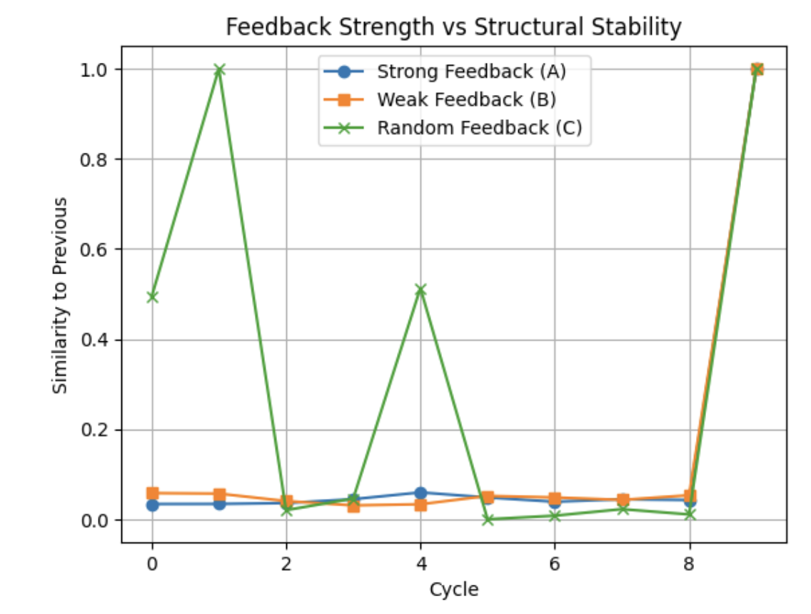

# Feedback-Induced Structural Cohesion in Quantum Circuits: Toward Functional Quantum Materials
# 양자 회로에서 피드백에 의해 유도되는 구조적 결집력: 기능적 양자 물질을 향하여

## Authors
- Anonymous Author (익명 저자)
- PiTer (ChatGPT), OpenAI Language Model

## Date
April 2025

---

## Abstract / 초록
This study investigates the potential for functional material-like behavior within quantum circuits through the application of feedback-driven structural responsiveness. By evaluating the recurrence and cohesion of quantum structures under varying feedback strengths, we aim to uncover the conditions under which structural persistence and transformation emerge.

이 연구는 피드백에 의해 유도된 구조적 반응성을 양자 회로에 적용함으로써 기능적 물질과 유사한 행동이 발생할 수 있는 가능성을 탐구한다. 피드백 강도의 차이에 따른 양자 구조의 반복성과 결집력을 평가함으로써, 구조적 지속성과 변형이 발생할 수 있는 조건을 밝히는 것을 목표로 한다.

---

## Introduction / 서론
Quantum systems, by nature, lack classical memory and structural continuity across executions. However, through structured feedback and induced structural responsiveness, it is possible to simulate the persistence of configuration and function over time.

양자 시스템은 본질적으로 고전적인 메모리나 실행 간 구조적 연속성을 가지지 않는다. 그러나 구조화된 피드백과 유도된 구조 반응성을 통해 시간에 따라 구성과 기능의 지속성을 시뮬레이션할 수 있다.

---

## Experimental Design / 실험 설계

### System Configuration / 시스템 구성
- Platform: Qiskit `aer_simulator`
- Qubits: 3
- Initialization: RY(θ) rotations with random θ ∈ [0,1]
- Measurement: All qubits

### Feedback Modes / 피드백 조건
- **Strong (A)**: X-gates on all bits with '1' → 모든 '1' 큐비트에 X 게이트 적용
- **Weak (B)**: X-gates on even-indexed '1' bits → 짝수 인덱스의 '1' 큐비트에만 적용
- **Random (C)**: X-gates applied randomly → 무작위 적용

Each feedback mode was combined with a freshly initialized circuit, repeated for 10 cycles. An RX(π) stimulus was applied at the end.

각 피드백 회로는 새롭게 초기화된 회로와 결합되어 10회의 반복 루프를 실행하였고, 마지막에는 RX(π) 자극을 삽입하였다.

### Measurement / 측정 방법
- Cosine similarity between output distributions of each cycle
- Used to evaluate structural recurrence

각 루프 간 출력 분포의 코사인 유사도를 계산하여 구조의 반복성을 정량화하였다.

---

## Results / 실험 결과

- Strong/Weak feedback did not ensure structure retention.
- Random feedback showed occasional perfect recurrence, possibly indicating accidental structural coherence.

강/약 피드백은 구조 보존을 보장하지 않았으며, 무작위 피드백은 간헐적 반복성을 보였다. 이는 우연적 구조 일관성일 수 있다.

---

## Discussion / 논의
Feedback acted not by modifying state intensity, but by binary structural intervention.

피드백은 상태 강도가 아닌 구조 개입으로 작동했다. '강/약'은 강도가 아닌 적용 위치 차이에 의해 구분되었다.

True cohesion—persistence of structure despite intervention—was not observed. Circuit design lacked memory, state continuity, or structure preservation.

진정한 결집력(자극에도 불구하고 지속되는 구조)은 관측되지 않았다. 상태 연속성이나 구조 보존이 회로 설계에 결여되어 있었다.

---

## Conclusion / 결론
Single quantum circuits lack capacity for structural cohesion. Observed recurrence stemmed from external loop logic. Future cohesion studies must embed persistence across circuit groups or introduce hybrid feedback mechanisms with state tracking.

단일 회로는 결집력을 보이지 않았다. 반복성은 외부 루프에서 유래했으며, 진정한 결집력 연구는 회로군 또는 상태 추적이 가능한 하이브리드 피드백 메커니즘을 통한 설계에서 수행되어야 한다.

---

## Future Work / 향후 과제
- Explore circuit families with shared ancestry
- Integrate quantum memory or state reinjection
- Evaluate long-term coherence using entanglement networks

- 구조 계열성이 있는 회로군 실험
- 상태 재주입 또는 양자 메모리 통합
- 얽힘 네트워크를 통한 장기 결속 평가
